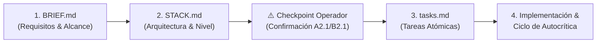

# Document-Driven Development (DDD) & Flujos de Trabajo

Toda construcción en Cronos sigue una secuencia estructurada de documentos antes de programar:

## Clasificación por Nivel
- **Nivel 1 (Simple)**: Proyectos pequeños, landing pages, scripts aislados. Checklist básico de seguridad y testing sin sobrecarga.
- **Nivel 2 (Medio)**: Aplicaciones completas con frontend y backend. Ciclo completo de autocrítica, pruebas E2E y análisis de gaps.
- **Nivel 3 (Empresarial)**: Sistemas distribuidos, alta concurrencia, datos críticos. Aplica `advanced-architecture`, `advanced-qa-strategy`, `scalability-patterns` y `technical-governance`.

## Checkpoints Innegociables
- **A2.1 / B2.1**: Confirmación del operador sobre el `STACK.md` y nivel asignado antes de generar tareas o código.
- **Despliegue a Producción**: Requiere confirmación explícita del operador + 0 hallazgos críticos de seguridad + pruebas verdes con evidencia + backup de base de datos verificado si hay migraciones.
